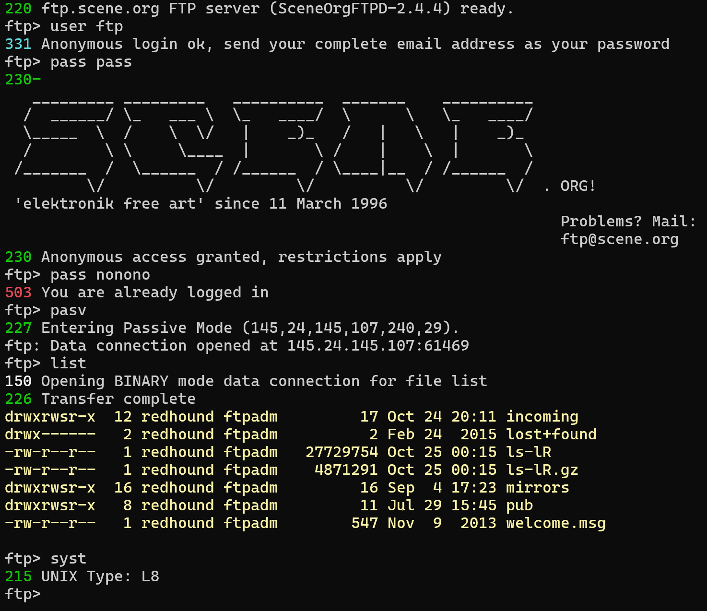

# FTP Client

A command-line FTP client implemented in C# with interactive operations.

## Features

- Basic FTP commands support
- Active and passive mode transfer support
- Colored command-line interface
- Cross-platform support (.NET 8.0)

## Screenshot



## Build & Run

### Build

```bash
cd src
dotnet build
```

### Run

```bash
dotnet run -- [-ip server_ip] [-port port_number]
```

Options:

- `-ip <server_ip>`: Server IP address, default to 127.0.0.1
- `-port <port_number>`: Server port number, default to 10021

## Project Structure

- `FtpClient.Core/` - Core functionality library
  - `FtpClient.cs` - FTP client implementation
  - `Models/` - Data models
  - `Interfaces/` - Interface definitions
- `FtpClient.CLI/` - Command-line interface
  - `Program.cs` - Program entry
  - `Core/` - CLI core functionality
  - `Utilities/` - Utility classes

## Development Notes

- Built with .NET 8.0
- Asynchronous IO operations
- Modular design with separated core and UI
